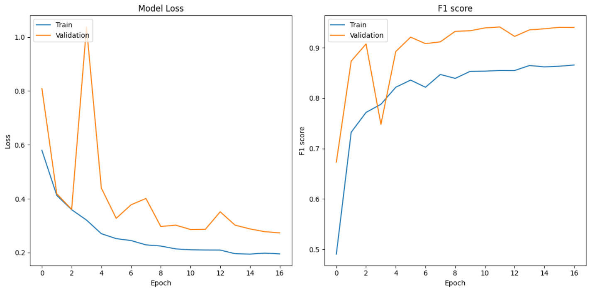
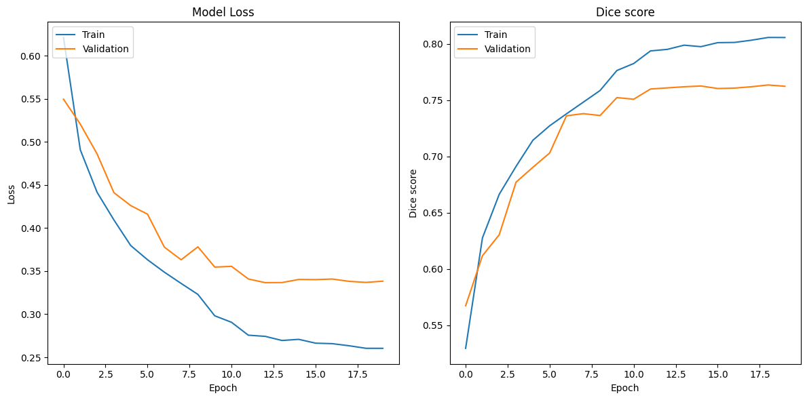
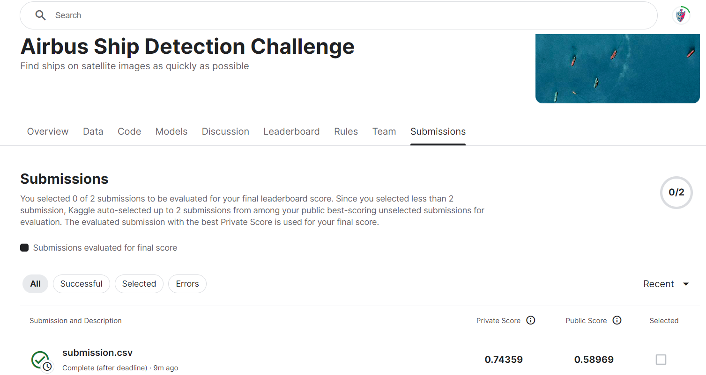
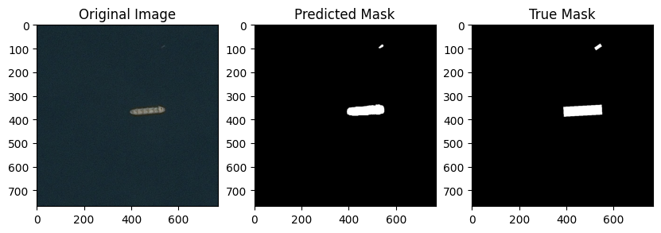
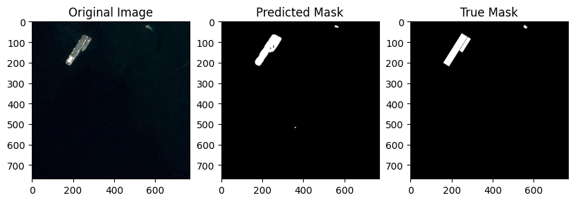
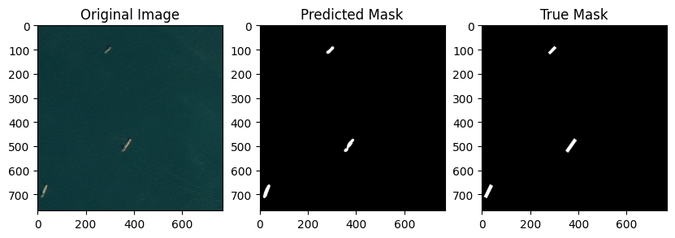
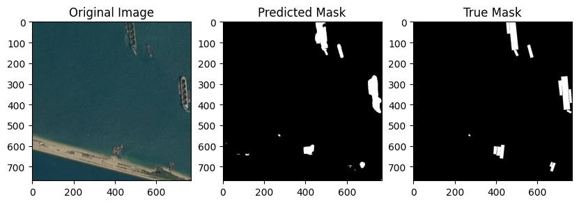
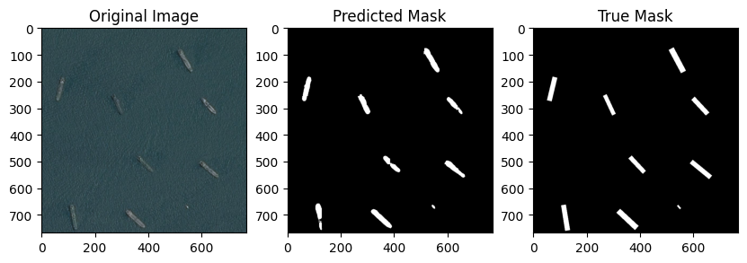

# Airbus Ship Detection 

## Ship data

The data was loaded from https://www.kaggle.com/competitions/airbus-ship-detection

After EDA, it became clear that satellite images were empty. In the section on training models.

## Solution

I decided to use a sequence of two models: classification (ResNet) and segmentation (UNet). Since a significant portion of the images are empty, using a classification model significantly reduces the number of false positives for the segmentation model and speeds up inference if we have many images.

So, initially, the classification model predicts whether there is a ship in the image. If not, we immediately return an empty mask. If yes, then we predict the mask using the segmentation model.

## Classification model
I used a modified architecture of the ResNet34 model, reducing the number of blocks. The model was trained on resized images of size 256x256, with balanced classes (50-50 ratio) for training.

Metric: F1 score

Optimizer: Adam with lr=0.001 and ReduceOnPlataeu

Loss function: Binary Cross-Entropy (BCE)

Data augmentation parameters:

Rotation range: 10 degrees

Width shift range: 0.1

Height shift range: 0.1

Shear range: 0.01

Horizontal flip: True

Vertical flip: True

Also employed early stopping with a patience of 5. The training lasted for 17 epochs.

Below are the training plots. The model achieved a good accuracy.

val_f1_score: 0.9404.



## Segmentation model

Model architecture: U-Net
The model was trained on 128x128 ship patches, only on images with ships.
The input size of the model depends on the scaling parameter for cropping grid. For example, choosing scaling=6, we define a 6x6 grid size for the original image. The input size of the model will be (128x128 (768/6)). For each image, the position of the ship mask pixel is determined, then we extract a piece of our grid image and mask containing this pixel.

Metric: Dice coefficient

Optimizer: Adam with learning rate = 1e-4 and ReduceOnPlateau

Loss function: BCE + Dice loss

Data augmentation parameters:

Rotation range: 10

Width shift range: 0.1

Height shift range: 0.1

Shear range: 0.01

Horizontal flip: True

Vertical flip: True

Fill mode: 'reflect'

Due to the chosen training method, to predict the entire mask, predictions need to be made for all grid pieces of the image (6x6) with a sliding window, which may slow down the model's prediction speed. However, this method provides much more information to the model than simply resizing the image, for example, to (256x256).

The scaling parameter must evenly divide 768 for correct implementation. Perhaps a better parameter could be scaling = 3 or 4, but I did not have enough memory for training with such a parameter.

Below are the training plots of the model for 20 epochs. A good accuracy was achieved:
val_dice_coefficient: 0.7623



Metrics for training and validation data may differ due to data leak. In discussions prior to this competition on the Kaggle platform, individuals noted that there are images in the dataset that intersect.

## Submission score

Training dataset is really huge, even after filtering data for training both models. I had to reduce the number of images to about 20%, therefore training time for each model was about 8 hours. Training on all data would take too much time to complete.



Submission score would have been higher if i had better hardware to train models on all the data.

## Deployment

Set up project

```bash
git clone https://github.com/sylfetiax/ShipDetection.git
cd path/to/ShipDetection
conda create -n ship python=3.9.18
conda activate ship
conda install pip
pip install -r requirements.txt
cd src
```

Create, train and save classification model
```bash
python classification_train.py --masks_csv 'path/to/file/train_ship_segmentations_v2.csv' --images_path 'path/to/folder/train_v2' --epochs 20 --save_path 'path/to/save/model/classification_model.keras'
```

Create, train and save segmentation model
```bash
python segmentation_train.py --masks_csv 'path/to/file/train_ship_segmentations_v2.csv' --images_path 'path/to/folder/train_v2' --epochs 20 --scaling 6 --save_path 'path/to/save/model/segmentation_model.keras'
```

Run inference
```bash
python inference.py --images_path 'path/to/folder/test_v2' --scaling 6
```

Note: your scaling param in train and in inference must be the same, if you run command above, it will load my trained models, where segmentation model has scaling=6

## Prediction examples







